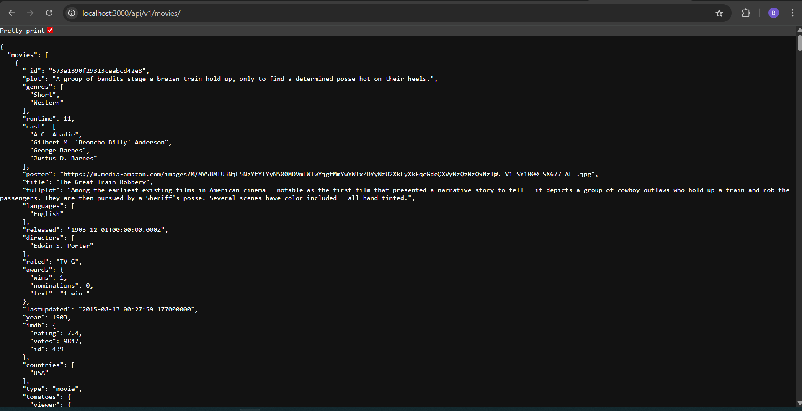

# LAB 02 - Movie Reviews Backend

## 1. Thông Tin Báo Cáo
- Môn học: Kỹ thuật phát triển hệ thống web
- Bài thực hành: Lab 02 - Xây dựng backend Movie Reviews
- Sinh viên: Bùi Quốc Huy
- MSSV: 23520593
- Lớp: IE213.Q21
- GVHD: ThS. Võ Tấn Khoa

## 2. Mục Tiêu Bài Lab
- Cài đặt môi trường Node.js cho backend
- Xây dựng API cơ bản với Express
- Kết nối MongoDB Atlas
- Truy xuất dữ liệu từ collection `movies`
- Áp dụng mô hình Route -> Controller -> DAO


## 3. Cấu Trúc Thư Mục
```text
lab02/
├── README.md
└── backend/
        ├── .env
        ├── .env.example
        ├── index.js
        ├── server.js
        ├── package.json
        ├── package-lock.json
        ├── api/
        │   ├── movies.route.js
        │   └── movies.controller.js
        └── dao/
            └── moviesDAO.js
```

## 4. Hướng Dẫn Chạy

### 4.1 Cài đặt dependencies
```bash
cd backend
npm install
```

### 4.2 Cấu hình biến môi trường
Tạo file `.env`:

```env
PORT=3000
MOVIEREVIEWS_DB_URI=<YOUR_MONGODB_ATLAS_URI>
MOVIEREVIEWS_NS=sample_mflix
```

### 4.3 Chạy server
```bash
npm run dev
```

### 4.4 Kiểm tra API
```bash
curl http://localhost:3000/api/v1/movies
```

Hoặc mở trình duyệt:

```text
http://localhost:3000/api/v1/movies
```

## 5. Quá trình thực hiện

### Bài 1: Thiết lập môi trường

#### 1.3 Tạo cấu trúc thư mục
```bash
mkdir -p backend
```

#### 1.4 Khởi tạo project
```bash
npm init -y
```

#### 1.5 Cài dependencies
```bash
npm install mongodb express cors dotenv
```
#### 1.6 Cài nodemon
```bash
npm install --save-dev nodemon
```

```json
"scripts": {
    "test": "echo \"Error: no test specified\" && exit 1",
    "start": "node server.js",
    "dev": "nodemon index.js"
  }
```

### 🔹 Bài 2: Xây dựng backend

### 2.1 Tạo tệp tin `server.js` để khởi tạo máy chủ web
- **Tạo file**: `backend/server.js`
- **Middleware**: `cors`, `express.json()`
- **Routing**:
  - mount `/api/v1/movies`
  - xử lý lỗi **404** (not found)

### 2.2 Tạo tệp tin `.env`
- **Tạo file**: `backend/.env`
- **Biến môi trường**:
  - `MOVIEREVIEWS_DB_URI`: URI kết nối MongoDB Atlas
  - `MOVIEREVIEWS_NS`: ví dụ `sample_mflix`
  - `PORT`: ví dụ `3000`
- **Ví dụ** (xem `lab2/.env.example`):
  - `MOVIEREVIEWS_DB_URI=mongodb+srv://<database_user>:<database_password>@.../`
  - `MOVIEREVIEWS_NS=sample_mflix`
  - `PORT=3000`

### 2.3 Tạo tệp tin `index.js` để kết nối DB và chạy máy chủ
- **Tạo file**: `backend/index.js`
- **Chức năng**:
  - đọc biến môi trường bằng `dotenv`
  - kết nối MongoDB bằng `mongodb.MongoClient`
  - gọi `MoviesDAO.injectDB(client)` sau khi kết nối DB
  - chạy server `app.listen(...)`

### 2.4 Tạo route cho Movies
- **Tạo file**: `backend/api/movies.route.js`
- **Endpoint**: `GET /api/v1/movies/`

### 2.5 Thiết lập DAO (Data Access Object)
- **Tạo folder**: `backend/dao`
- **Tạo file**: `backend/dao/moviesDAO.js`
- **Class**: `MoviesDAO`
  - `injectDB(conn)`: tham chiếu tới collection `movies` trong DB `process.env.MOVIEREVIEWS_NS`
  - `getMovies({ filters, page, moviesPerPage })`: trả `{ moviesList, totalNumMovies }` (mặc định `page=0`, `moviesPerPage=20`)

### 2.6 Thiết lập Controller
- **Tạo file**: `backend/api/movies.controller.js`
- **Class**: `MoviesController`
  - `apiGetMovies(req, res, next)`: nhận query (`page`, `moviesPerPage`, `rated/title`), gọi `MoviesDAO.getMovies(...)` và trả JSON

### 2.7 Đưa Controller vào định tuyến
- **Cập nhật** `backend/api/movies.route.js` để `GET /` gọi `MoviesController.apiGetMovies`

## 6. Kết Quả Chạy

### Chạy server
```bash
npm run dev
```
### Kết quả
- Server chạy tại `http://localhost:3000/api/v1/movies`
- API trả về JSON danh sách phim
- 
  